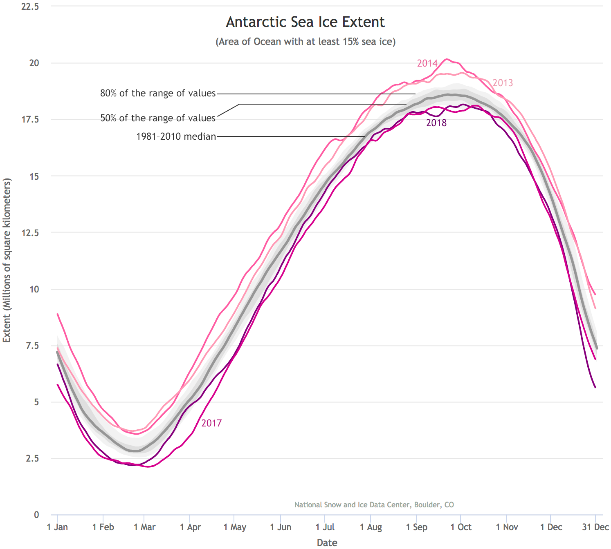
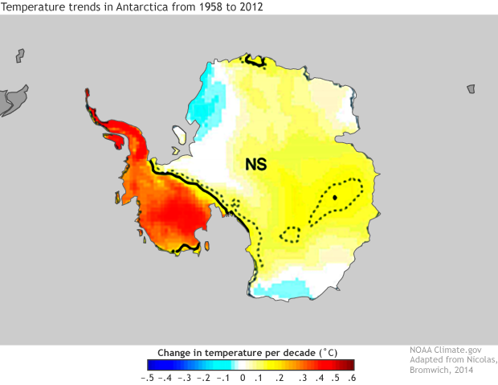
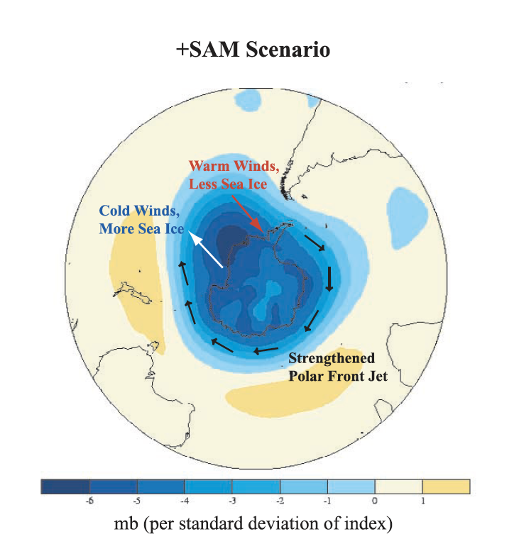
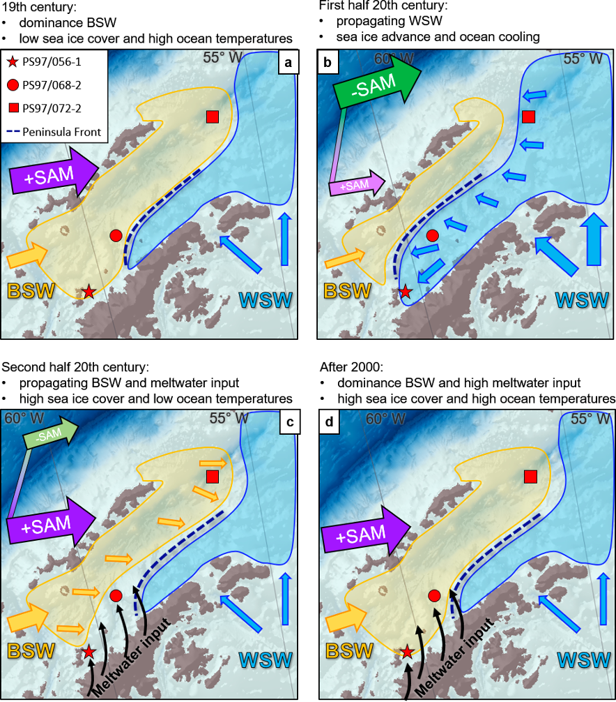
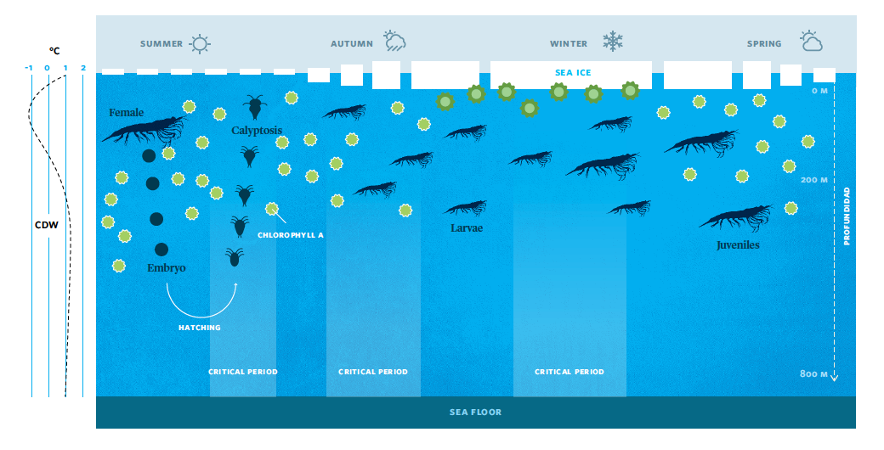

```{=tex}
\fontsize{12}{26}
\selectfont{}
```


```{r setup, eval=FALSE, echo = FALSE, warning = FALSE, message = FALSE}
knitr::opts_chunk$set(collapse = TRUE, comment = "  ", fig.align = 'center', cache=FALSE)
library(knitr)
library(tidyverse)
```

## 1. INTRODUCCION

\quad
La Antartica y el Océano Austral (OA) que lo circunda son componentes activos del clima global. Estos dos elementos también son profundamente influenciados por las muchas variabilidades atmosféricas remotas y regionales en períodos que van desde escalas de tiempo sinópticas a geológicas [@Yuan2004]. En este sentido, la Antártica y el Oceáno Austral asociado han jugado un rol fundamental para entender la dinámica de muchos forzantes ambientales, entre ellos, el hielo marino, y su variabilidad asociada a los distintos fenómenos atmosféricos que influyen en estos procesos. Este ensayo tiene como finalidad identificar y describir las particularidades de los principales fenómenos atmosféricos y como estos influyen en la formación, expansión y contracción de hielo Antártico. A su vez daremos una mirada historica y también como el Cambio Climático (CC) genera desacoples en estos fenómenos atmosféricos, y con ello, sus implicancias en la dinámica propia del hielo marino Antártico. Todo esto con un foco en particular en la Península Antártica (PA). Por último, trataremos de entender como el hielo marino y su ciclos se correlacionan con la dinámica de las poblaciones marinas del krill (*Euphausia superba*), las cuales son la base de los ecosistemas marinos en el Océano Austral. 

\pagebreak

## 2. DESARROLLO

\quad
La superficie del océano alrededor de la Antártica se congela en invierno y se derrite cada verano. El hielo marino antártico generalmente alcanza su extensión máxima anual a mediados o finales de septiembre, y alcanza su mínimo anual a finales de febrero o principios de marzo [@Scott2019] (Figura 1). El hielo marino antártico se extiende a unos 12 millones de kilómetros cuadradas en invierno convirtiendola en un continente rodeado por un vasto océano lo cual tiene muchas implicancias en como aquí se manifiestan los procesos climáticos-atmosféricos.

```{r echo=FALSE, out.width = "70%", fig.align='center', fig.cap= "Extensión del hielo Antártico y su fluctuación intra e interanual (ex. www.climate.gov)"}

```
\quad
El hielo marino puede expandirse libremente a través del Océano Austral en invierno, pero no puede acercarse al Polo Sur de lo que la costa antártica lo permitirá. En promedio, alrededor del 15 por ciento de la cubierta de hielo invernal del Océano Austral, es por ello que la mayor parte del hielo marino de la Antártica tiene solo un invierno como máximo. Como resultado, el hielo marino antártico es relativamente delgado, a menudo de 1 metro o menos. Sin embargo, las nevadas a menudo espesan el hielo marino antártico. La pesada carga de nieve puede deprimir los témpanos de hielo, y el agua de mar puede inundar posteriormente esos témpanos [@Scott2019].

Con respecto al hielo continental, la elevación antártica promedia cerca de 2000 metros (más de 1000 mm. sobre el nivel del mar). Las partes más altas de la capa de hielo, cerca del centro de la Antártida Oriental, rivalizan con la altura de sus montañas más altas, a casi 4000 metros.  Por todas estas características, este océano es una de los áreas más sensibles al CC. Los forzantes claves y su influencia en procesos claves dentro del OA ya han experimentado cambios en sus dinámicas naturales, entre ellos se pueden identificar; la temperatura del océano, la dinámica del hielo marino, la estratificación, las corrientes, entre otros  [@Morley2020; @Sylvester2021].

En comparación con el Ártico, el continente Antártico está respondiendo con menos intensidad al cambio climático [@Groh2021]. En este sentido, el OA está amortiguando los impactos de vientos y patrones climáticos que tienden a aislarla de lo que podrían influir las entradas de aire cálido. Sin embargo, y en promedio, la Antártica se ha descongelado y ha perdido mucho hielo [@Nicolas2014], y esto puede tener implicancias futuras. El reporte del Grupo Intergubernamental de Expertos sobre el CC (IPCC por sus siglas en inglés) [@IPCC2014] encontró una tendencia al calentamiento en la Antártica, pero no a niveles concluyentes. Por otro lado, a finales del siglo XX, el agujero de ozono y sus efectos en la circulación del aire pueden haber protegido parcialmente al continente de la influencia del calentamiento global de las emisiones de gases de efecto invernadero [@Damiani2020]. Respecto a la influencia del clima sobre la dinámica del hielo marino en la PA, @Massom2008 identificaron una extrema fase de compactación de hielo frente a anomalías de temperatura, vientos y diferencias de presión atmosferica. La variabilidad y ciclos del hielo internanuales e históricos son influenciados por forzantes  atmosfericos. Estos procesos estan profusamente descritas en la literatura [@Carrasco2018; @Damiani2020; @Massom2008; @Mayewski2017; @Rohli2018; @Stammerjohn2008; @Stammerjohn2008a; @Turner2004; @Yuan2004]. 

Sin embargo, y al igual que otros continentes, la Antártica siente los impactos del CC a diferentes ritmos en diferentes lugares. En la Península Antártica, de menor elevación y con menor latitud, experimentó rápidos aumentos de temperatura durante varias décadas en el siglo XX. Luego, a finales de la década de 1990, los aumentos de temperatura se ralentizaron, y desde 2000, la Península se ha enfriado. Durante los últimos 40 años la PA ha sido una de las zonas más afectadas de la región en términos de cambios ambientales. Los más notables de estos tienen
relación con un aumento de los vientos del oeste, un aire más alto y profundo temperaturas del océano, y reducciones en el hielo marino, tanto su extención y el tiempo de formación. Estudios del 2016 y 2021 concluyeron que el reciente enfriamiento se puede explicar por la variabilidad natural y condiciones atmosféricas del Océano Pacífico. A pesar del reciente enfriamiento o *hiatus* [@Turner2016; @Carrasco2021b], las partes septentrionales de la PA siguen siendo mucho más cálidas de lo que eran a mediados del siglo pasado [@Scott2020; @Nicolas2014; @Turner2005] (Figura 2), considerando a la PA como una de las partes de la Tierra que ha experimentado un gran calentamiento los últimos 50 años, habiendo aumentado a una tasa de 0.56  ºC década (1 durante el año y 1.09 ºC década) [@Turner2005].


\pagebreak

```{r echo=FALSE, out.width = "100%", fig.align='center', fig.cap= "Tendencias de temperatura durante todo el año 1958 al 2012 por década en la Antártica (Ex. Nicolas y Bromwich, 2014"}

```

En relación a variabilidad historica de la formación de hielo marino en el OA, es necesario entender como ha sido la producción en el pasado y ver como se están produciendo los cambios, tanto así en la actualidad como en el futuro por influencia y desajustes de las condiciones atmosféricas imperantes. En función de las características descritas previamente en relación a la dinámica del hielo marino en el continente Antártico, es necesario entender entonces cuales son los forzantes atmosféricos que influyen en ello. Un corolario de esto es la evidente demostración de forzantes globales que afectan a la dinámica del hielo en el Océano Austral y en particular en la Península Antártica, que se hacen sentir en el presente y también afectarán en el futuro.

Con estos antecedentes comprender la dinamica del hielo marino en la PA y su relación con los fenómenos atmosfericos que influyen en ello es el objetivo de este ensayo. Las forzantes atmosférico-oceanográficos son los que se manifiestan por cambios producidos en la atmósfera y que tienen implicancias en el mar. Entre aquellos forzantes, los que han sido mas estudiados e identifcados como factores influyentes en componentes del OA, son el Southern Annular Mode (SAM) y El Niño Southern Oscillation (ENSO).


## 2.1. ENSO y su influencia en el hielo marino en la Península Antártica


Un fenómeno oceanográfico-atmosférico que tiene implicancias en los océanos es la Oscilación del Sur El Niño, que en inglés es El Niño Southern Oscilation (de aquí en más ENSO, por sus siglas en inglés). El ENOS, que incluye su contraparte La Niña, es la variabilidad climática interanual más significativa que tiene lugar en el planeta. Ocurre en la cuenca ecuatorial del Océano Pacifico con alteraciones de presión atmosféricas, cuyos efectos se hacen sentir más allá de los trópicos, en diversos lugares alrededor del planeta, incluso en la Antártica [@Stammerjohn2008; @Carrasco2018], indicando una relación inversa entre las anomalías estaciónales de presión al nivel del mar en las latitudes polares y ENSO con desfase negativo de un año [@Carrasco2018]. Un evento “El Niño” consiste principalmente en un calentamiento por sobre lo normal de la superficie del Océano Pacífico ecuatorial central y oriental (mayor a 25ºC), acompañado por un aumento del nivel del mar (mayor a 15 cm.). En cambio durante el fenómeno de El Niño los vientos alisios se debilitan o dejan de soplar, la máxima temperatura marina se desplaza hacia la Corriente de Perú que es relativamente fría y la mínima temperatura marina se desplaza hacia el Sureste Asiático. Esto provoca el aumento de la presión atmosférica en el sureste asiático y la disminución en América del Sur. Todo este cambio ocurre en un intervalo de seis meses, aproximadamente desde junio a noviembre. 

Luego de una revisión de la influencia de este forzante, @Carrasco2018 indica que existe una relación entre la Oscilación del Sur (OS) y la concentración del hielo marino que rodea la Antártica, en particular en el sector del Mar de Weddell por medio del Dipolo Antártico (ADP), el cual es una variabilidad climática de latitudes altas en el sistema interactivo de la atmósfera-océano-hielo de fase opuesta entre el hielo marino y las anomalías de la temperatura superficial del mar en el Océano Pacífico Sur y el Océano Atlántico Sur, y que responde a la forzante del ENOS [@Yuan2004]. @Carrasco2018 analizó el comportamiento clímatico del sector norte de la PA durante los mayores eventos del ENSO (Figura 3) que sucedieron en los ultimos 50 años, y en donde concluyeron que existe un impacto de ENOS en la formación del hielo marino en la Antártida, en particular en el sector oeste de la PA, en el Mar de Bellingshausen y Amundsen. La formación y extensión hacia el norte del hielo marino puede verse frenada cuando prevalecen vientos del noroeste en el sector, situación que se da con eventos La Niña. Por el contrario, la formación y desplazamiento del hielo marino puede verse favorecido cuando la frecuencia de vientos del noroeste es baja y débil o incluso la circulación del viento sea del oeste y suroeste, situación que ocurre en los eventos El Niño. Así, una baja presión en el Mar de Bellingshausen asociado a El Niño puede favorecer un flujo con componente del sur (o flujo del noroeste menos frecuente y/o más débiles) en el sector del Mar de Bellingshausen y un flujo del sur más débil en el sector del Mar de Ross, favoreciendo y desfavoreciendo, respectivamente, la formación y extensión de hielo marino hacia el norte [Carrasco2021a]. 


```{r echo=FALSE, out.width = "80%", fig.align='center', fig.cap= "Comportamiento del Índice de Oscilación del Sur (IOS, eje izquierdo) junto a las anomalías de la concentración de hielo marino (CHM) en el sector norte del Mar de Bellingshausen. (Ex. Carrasco, 2018)"}
knitr::include_graphics("images/Fig5.pdf")
```

\pagebreak

## 2.2. SAM y su influencia en el hielo marino en la Península Antártica

La variabilidad de la circulación atmosférica estacional en el hemisferio sur está modulado por
varios modos climáticos de variabilidad de la circulación atmosférica. Uno de los modos que dominan esta variabilidad es el llamado Modo Anular del SUR o Southern Annular Mode (de aquí en mas SAM, por sus siglas en inglés). En general, la variabilidad SAM se caracteriza por anomalías zonales simétricas de presión atmosférica de opuestos signo entre la Antártida y las latitudes medias. Varios estudios han explorado las posibles conexiones entre hielo marino del Océano Austral y SAM [@Massom2008; @Stammerjohn2008; @Nicolas2014]. Por otro lado, el agotamiento del ozono influye directamente en el modo principal de variabilidad de la circulación atmosférica en las regiones extratropicales del sur. Se cree que la tendencia del verano (intensidad SAM +) se debe principalmente al agotamiento del ozono polar estratosférico [@Damiani2020]. 

Una forma de medir el SAM es a través de un índice calculado como el gradiente de presión entre las latitudes medias y la Antártida, que cuando es muy positivo, da como resultado vientos del oeste que son más fuertes que el promedio y se desplazan hacia el polo. Desde 1957 ha habido un aumento significativo de la fase SAM positivo en el verano y otoño austral. La variabilidad del SAM tiene un impacto significativo en la temperatura de la superficie antártica, la precipitación y el hielo marino [@Marshall2017].

\pagebreak
Al mismo tiempo, la variabilidad del hielo marino observada en las últimas dos décadas de observaciones satelitales muestran disminuciones en concentración y duración en el oeste de la Península Antártica [@Newman2016]. Estudios previos han demostrado que la duración y la concentración mensual del hielo marino Antártico han disminuido fuertemente en la región oeste de la PA. Estas observaciones sugieren que las tendencias del hielo marino en la región oeste de la PA son principalmente reflejando los cambios en las interacciones hielo-atmósfera que ocurren
durante la primavera-otoño durante la retirada del hielo marino y la posterior avance por efectos de las fases y duraciones del SAM (Figura 4) [@Stammerjohn2008; @Stammerjohn2008a].


```{r echo=FALSE, out.width = "60%", fig.align='center', fig.cap= "Representación esquemática de la respuesta de hielo en latitudes altas por efecto de la fase SAM + (Ex. Stammerjohn et al. 2008)"}

```


Finalmente es necesario también señalar que ambos fenomenos atmosfericos, es decir,  el Southern Annular Mode (SAM) y El Niño Southern Oscillation (ENSO) están interanctuando constantemente y tienen efectos combinados sobre la criósfera. En este sentido existen estudios recientes que han examinado los impactos combinados de ENSO y SAM en la respuesta de alta latitud tanto de la circulación atmosférica y hielo marino [@Stammerjohn2008; @Stammerjohn2008a].


Respecto a antecedentes históricos de la dinámica del hielo marino en la PA y sus condicionantes atmosféricas, @Vorrath2020 analizaron imágenes satelitales del hielo marino durante los últimos 40 años y observaron diiferencias entre las estimaciones del hielo marino basadas en biomarcadores, el salida del modelo de los últimos 240 años, registros de núcleos de hielo y reconstruidos patrones de circulación atmosférica como el Niño – Oscilación del Sur (ENSO) y Anular del Sur Modo (SAM) (Figura 5). En este trabajo identificaron los distintos patrones atmosféricos y los efectos diferenciados sobre la formación de hielo en la PA. Estos hallazgos tienen implicancias importantes frente a escenarios climáticos futuros y su impacto en este importante compomente de la criósfera.


```{r echo=FALSE, out.width = "100%", fig.align='center', fig.cap= "Ilustración de momentos historicos y los impulsores ambientales en la formación de hielo en la PA (Ex. Vorrath et al. 2020)"}

```

\pagebreak 


Los fenómenos atmosféricos y su conectividad con la dinámica del hielo marino en la Península Antártica no solo tiene implicancias en regulaciones climáticas si no también en el ecosistema del OA asociado. Existen contundentes demostraciones del estrecho vínculo entre los ciclos de formación de hielo marino antártico y la dinámica de las poblaciones de krill, en particular en períodos de reproducción y crecimiento [@ILAIA2021; @Flores2012; @Flores2012a; @Pinones2016; @Walsh2020]. En este sentido, el krill depende de las condiciones ambientales de temperatura, clorofila pero por sobre todo del hielo marino para su supervivencia, ya que utiliza al hielo marino como refugio y este a su vez se convierte en una zona de retención del alimento, como lo indica la Figura 6. 


```{r echo=FALSE, out.width = "90%", fig.align='center', fig.cap= "Esquema del ciclo de vida del krill y su relación con la formación de hielo marino Antárico (Ex. Piñones y Fedorov, 2016)"}

```

Dado que durante las últimas cuatro décadas la PA ha sido una de las zonas más afectadas de la región en términos de cambios ambientales. Los más notables de estos generan un aumento de los vientos del oeste, un aire más alto y profundo  temperaturas del océano, y esto se transfiere en reducciones en el hielo marino, tanto su extensión y el tiempo de formación. Desde el comienzo de los registros de hielo basados en satélites cubierta (década de 1980) se ha observado que la formación de hielo ahora ocurre casi dos meses después que hace 30 años, y esto puede tener implicaciones para la supervivencia de las larvas de krill .Esta situación esta comenzando a preocupar a diversos investigadores y administradores por el futuro de esta importante población base del ecosistema antartico en términos de trama trófica asociada, pero tambien en su impacto en las pesquerías que explotan el recurso.


\pagebreak

## 3. DISCUSION


Como síntesis de lo anteriormente expuesto, existen fuertes evidencias de la interacción atmosfera-hielo marino y sus consecuencias  comprobadas en el continente Atrártico y en particular en la PA, las cuales son consistentes con el rápido calentamiento de la región. Los cambios en la duración de la temporada de hielo se deben principalmente por cambios en el avance del hielo marino otoñal y en menor grado el retiro del hielo marino de primavera. Las mayores anomalías hacia un un retroceso algo más temprano y un avance mucho más tarde co-ocurren con fuertes vientos del norte durante La Niña y / o + SAM y una combinación de estos. 

Mas allá de lo técnico y complejo que es recabar conocimiento y entendimiento sobre como los fenómenos atmosféricos como el ENSO y el SAM se conectan con las distintas componentes de la tierra, y en particular con el continente antártico, este ensayo científico fue un paso inicial y un sustrato cognitivo para, en primer lugar, reconocer la importancia de estos fenómenos, como ellos se desencadenan y como actuan, y a su vez identificar las fuertes implicancias que ello tiene para otros procesos asociados, impactando tambien a los ecosistemas que componen a la biósfera.Es evidente que, si bien son fenómenos atmósfericos que estan en funcionamiento hace miles de años, cualquier forzante antropogénica puede modificar sus ciclos, dinamica temporal así como su magnitud y con ello generar desequilibrios indeterminados en los productivos pero frágiles ecosistemas asociados.


\pagebreak

## 4. REFERENCIAS


